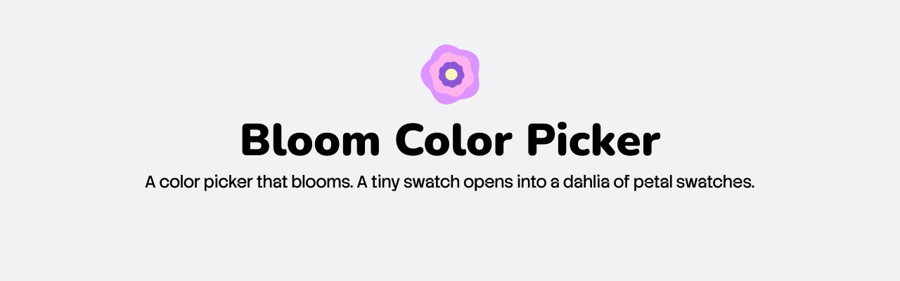
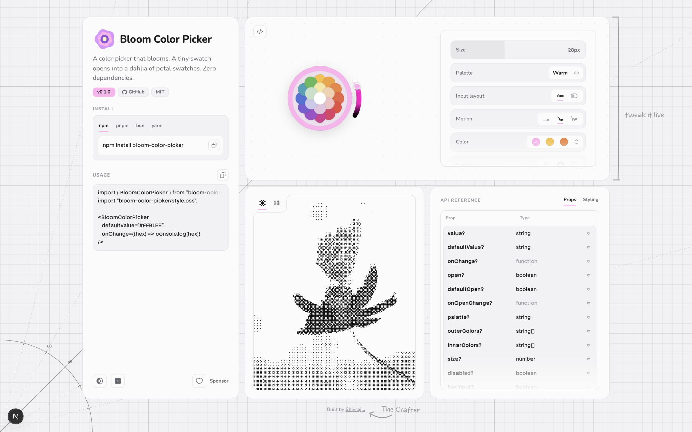

<a href="https://bloom-color-picker.shivrajroy.in">
  <picture>
    <source media="(prefers-color-scheme: dark)" srcset=".github/bloom-github-banner-dark.svg" />
    
  </picture>
</a>

  <a href="https://www.npmjs.com/package/bloom-color-picker"><picture><source media="(prefers-color-scheme: dark)" srcset="https://shieldcn.dev/npm/bloom-color-picker.svg?variant=outline&font=geist-mono&color=ffb1ee" /></picture></a>
  <picture><source media="(prefers-color-scheme: dark)" srcset="https://shieldcn.dev/badge/dependencies-zero.svg?variant=outline&font=geist-mono&logo=false&color=ffb1ee" /></picture>
  <a href="https://github.com/shivraj-roy/bloom-color-picker"><picture><source media="(prefers-color-scheme: dark)" srcset="https://shieldcn.dev/github/shivraj-roy/bloom-color-picker/license.svg?variant=outline&font=geist-mono&color=ffb1ee" /></picture></a>
  <a href="https://github.com/shivraj-roy/bloom-color-picker/actions"><picture><source media="(prefers-color-scheme: dark)" srcset="https://shieldcn.dev/github/shivraj-roy/bloom-color-picker/ci.svg?variant=outline&font=geist-mono" /></picture></a>

A flower-inspired color picker. A small swatch blooms open into a dahlia of petal swatches with a brightness arc — pick a petal, drag the arc, done.

- Zero runtime dependencies.
- Spring-quality animations in pure CSS, no animation library.
- Custom palettes, proportional sizing, per-part class overrides.
- Light/dark/system theming built in.

→ Check out the live demo: https://bloom-color-picker.shivrajroy.in

<a href="https://bloom-color-picker.shivrajroy.in">
  <picture>
    <source media="(prefers-color-scheme: dark)" srcset=".github/bloom-site-dark.svg" />
    
  </picture>
</a>

## Packages

This is a monorepo:

- [`packages/react`](./packages/react) — the [`bloom-color-picker`](https://www.npmjs.com/package/bloom-color-picker) npm package. See its own [README](./packages/react/README.md) for installation and the full API/props reference.
- [`apps/web`](./apps/web) — the docs/marketing site above.

> Using this at work or in a side project? [Sponsor me](https://github.com/sponsors/shivraj-roy) to help with support and maintenance.
